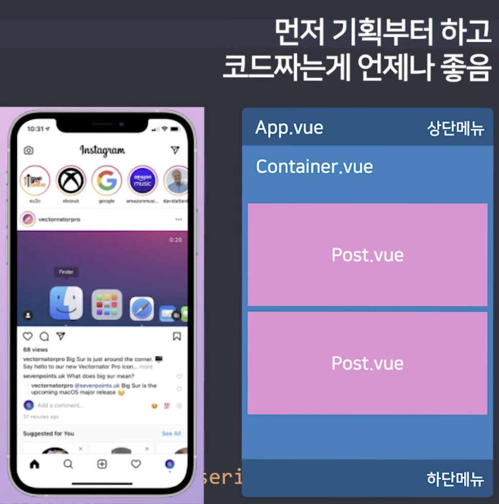

# Part 3 : 인스타그램 만들기

한달만에 듣는거라 거의 다 까먹음 - 처음부터 다시 적어가면서 하자

## 01. vue project create

`vue create vuestagram`

오픈한 폴더 하위폴더에 프로젝트 생성 됨

```shell
🎉  Successfully created project vuestagram.
👉  Get started with the following commands:

 $ cd vuestagram
 $ npm run serve
```

잘 생성 된건가?

```shell
cd vuestagram
npm run serve
```

```shell
 DONE  Compiled successfully in 965ms                                                                                                                                                                         오후 5:52:58


  App running at:
  - Local:   http://localhost:8080/ 
  - Network: http://192.168.0.13:8080/

  Note that the development build is not optimized.
  To create a production build, run npm run build.

```

들어가면 잘 나옴


Hello world 다 지우고 새로 넣을꺼임

무작정 작성하지 말고 기획 먼저 하고 하자



인스타 보면 상 하단 메뉴는 고정임 - app.vue에서 관리

안에 있는 내용만 바뀐다 - container.vue
안에 있는 내용은 post, update_page, ... 이렇게 만든 네용을 container에 꽂는거임

컴포넌트는 다른곳에서 사용하려고 하는거
- 라우터 나눌 페이지도 컴포넌트
- html 너무 길어지면 컴포넌트

컴포넌트는 필수가 아닌 관리하기 위한 도구

css, html은 이미 준비되어있음 - 복사 해서 사용

복사 붙여넣기 하고 코드 정렬 - VScode는 `Option + Shift + F`

<details>
<summary>App.vue source code</summary>
<div markdown="1">

```vue
<template>
  <div class="header">
    <ul class="header-button-left">
      <li>Cancel</li>
    </ul>
    <ul class="header-button-right">
      <li>Next</li>
    </ul>
    
  </div>

  <Container />

  <div class="footer">
    <ul class="footer-button-plus">
      <input type="file" id="file" class="inputfile" />
      <label for="file" class="input-plus">+</label>
    </ul>
  </div>
</template>

<script>
export default {
  name: "App",
  components: {},
};
</script>

<style>
body {
  margin: 0;
}
ul {
  padding: 5px;
  list-style-type: none;
}
.logo {
  width: 22px;
  margin: auto;
  display: block;
  position: absolute;
  left: 0;
  right: 0;
  top: 13px;
}
.header {
  width: 100%;
  height: 40px;
  background-color: white;
  padding-bottom: 8px;
  position: sticky;
  top: 0;
}
.header-button-left {
  color: skyblue;
  float: left;
  width: 50px;
  padding-left: 20px;
  cursor: pointer;
  margin-top: 10px;
}
.header-button-right {
  color: skyblue;
  float: right;
  width: 50px;
  cursor: pointer;
  margin-top: 10px;
}
.footer {
  width: 100%;
  position: sticky;
  bottom: 0;
  padding-bottom: 10px;
  background-color: white;
}
.footer-button-plus {
  width: 80px;
  margin: auto;
  text-align: center;
  cursor: pointer;
  font-size: 24px;
  padding-top: 12px;
}
.sample-box {
  width: 100%;
  height: 600px;
  background-color: bisque;
}
.inputfile {
  display: none;
}
.input-plus {
  cursor: pointer;
}
#app {
  box-sizing: border-box;
  font-family: "consolas";
  margin-top: 60px;
  width: 100%;
  max-width: 460px;
  margin: auto;
  position: relative;
  border-right: 1px solid #eee;
  border-left: 1px solid #eee;
}
</style>
```

</div>
</details>

<details>
<summary>Container.vue source code</summary>
<div markdown="1">

```vue
<template>
  <div>
    <Post />
    <Post />
    <Post />
  </div>
</template>

<script>
export default {
  name: "Container",
  components: {},
};
</script>

<style>
</style>

```

</div>
</details>

<details>
<summary>Post.vue source code</summary>
<div markdown="1">

```vue
<template>
  <div class="post">
    <div class="post-header">
      <div class="profile"></div>
      <span class="profile-name">ChanKim</span>
    </div>
    <div class="post-body"></div>
    <div class="post-content">
      <p>43 Likes</p>
      <p><strong>글쓴이아이디</strong> 임시내용</p>
      <p class="date">May 15</p>
    </div>
  </div>
</template>

<script>
export default {
  name: "Post",
  components: {},
};
</script>

<style>
.post {
  width: 100%;
}
.profile {
  background-image: url("https://placeimg.com/100/100/arch");
  width: 30px;
  height: 30px;
  background-size: 100%;
  border-radius: 50%;
  float: left;
}
.profile-name {
  display: block;
  float: left;
  padding-left: 10px;
  padding-top: 7px;
  font-size: 14px;
}
.post-header {
  height: 30px;
  padding: 10px;
}
.post-body {
  background-image: url("https://placeimg.com/640/480/animals");
  height: 450px;
  background-position: center;
  background-size: cover;
}
.post-content {
  padding-left: 15px;
  padding-right: 15px;
  font-size: 14px;
}
.date {
  font-size: 11px;
  color: grey;
  margin-top: -8px;
}
</style>

```

</div>
</details>


---

아니 근데 컴포넌트 임포트 어떻게 하더라?
```vue
<template>
  ...
  <Container /> <!-- 3. 사용할 컴포넌트 입력-->
  ...
</template>

<script>
import Container from "./components/Container";
// 1. import Component_name from Component_location
export default {
  name: "App",
  components: {
    Container, // 2. Component 이름 작성
  },
};
</script>

```

### 숙제
Post에 준비된 데이터를 넣어보자
1. App.vue에 데이터 보관
   * 데이터가 길어서 따로 파일로 만들어서 보관 및 로딩
2. 여러 데이터들이 다 들어가있음
   * Post.vue에 데이터 바인딩 진행
3. 이미지는 어려울 수 있음 - 해보고 안되면 다음에 같이할꺼임
   * App.vue에 데이터가 있음
   * props로 2번 값을 잘 넘겨봐라 - App -> Container -> Post 

---
### 1. 값을 어떻게 넣더라?

```json
// ./asset/postData.json
[
    {
        "name": "Kim Hyun",
        "userImage": "https://placeimg.com/100/100/arch",
        "postImage": "https://placeimg.com/640/480/arch",
        "likes": 36,
        "date": "May 15",
        "liked": false,
        "content": "오늘 무엇을 했냐면요 아무것도 안했어요 ?",
        "filter": "perpetua"
    },
    {
        "name": "John Doe",
        "userImage": "https://placeimg.com/200/200/people",
        "postImage": "https://placeimg.com/640/480/people",
        "likes": 20,
        "date": "Apr 20",
        "liked": false,
        "content": "흔한 자랑스타그램",
        "filter": "clarendon"
    },
    {
        "name": "Minny",
        "userImage": "https://placeimg.com/100/100/animals",
        "postImage": "https://placeimg.com/640/480/animals",
        "likes": 49,
        "date": "Apr 4",
        "liked": false,
        "content": "우리집 개는 화장실 물도 내림",
        "filter": "lofi"
    }
]
```

```vue
<!-- App.vue -->
<script>
...
import postData from "./assets/postData.json";

export default {
  name: "App",
  components: {
    Container,
  },
  data() {
    return {
      postData: postData, // 사용할 값을 이렇게 선언하면 됨
    };
  },
};
</script>
```

### 2. props 어떻게 쓰더라?
